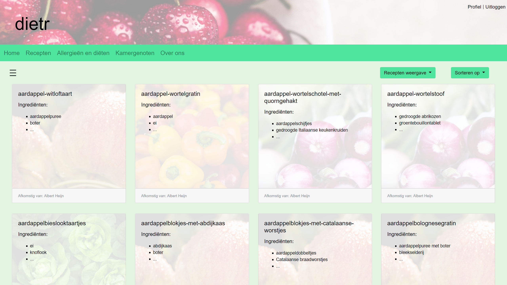

# Dietr

[![build status][image-build]][build]
[![issues][image-issues]][issues]
[![releases][image-releases]][releases]
[![license][image-license]](LICENSE)
[![website][image-website]](https://dietr.io)



Dietr is a web app that allows users to search recipes and takes in account of their allergies and preferences. It also allows users to add roommates and check for their allergies and preferences. All allergies are gatherd from external sources using a custom made crawler.

## Table of Contents

- [Installing](#installing)
- [Usage](#usage)
- [Contributing](#contributing)
- [Releases](#releases)
- [License](#license)

## Installing

```bash
$ git clone https://github.com/essoplerck/dietr.git
$ pip3 install -r requirements.txt
```

This project is build using python version `3.6`. To check your python version run the following command.

```bash
$ python3 -V
```

This project requires redis and MySQL, use the following command to install:

```bash
$ sudo apt-get install redis-server
$ sudo apt-get install mysql-server
$ mysql_secure_installation
```

## Usage

To run the project on a properly configured server run the following command:

```bash
$ sudo python3 dietr.p
```

When serving localy the config needs to be changed. Open the configurationu using `$ sudo nano config.py` and comment out the following lines:

```python
SECRET_KEY = 'YOUR_SECRET_KEY_HERE'
DATABASE_PASSWORD = 'YOUR_PASSWORD_HERE'
```

This project requires a relis server to run at `127.0.0.1:6379`. To run redis
run the following command in a separte prompt:

```bash
$ redis-server
```

This project also requires a MySQL server to be active at `127.0.0.1`. Alternativly a external server can be used. To user a external server replace the following lines:

```python
self.connection = sql.connect(database='production',
                              host='127.0.0.1',
                              user='dietr',
                              password=password,
                              cursorclass=sql.cursors.DictCursor)
```

With:

```python
self.connection = sql.connect(database='renswnc266_production',
                              host='185.182.57.56',
                              user='renswnc266_dietr',
                              password='qvuemzxu',
                              cursorclass=sql.cursors.DictCursor)
```

Change the **SECRET_KEY** to ensure the safety of the program.

```python
import os

# Set generate a 24 bit secret key
SECRET_KEY = hex(int.from_bytes(os.urandom(32), byteorder='big'))

del os
```

## Releases

- `v0.5.0-alpha` Inital release
- `v0.5.1-alpha` Minor bug fixes and prep for demo
- `v0.9.0-beta` Prepare for final release
- `v0.9.5-beta` Minor bug fixes
- 'v1.0.0' Initial release

A detailed changelog can be found [here](CHANGELOG.md).

## Contributing

See [contributing](CONTRIBUTING.md)

## License

Code and documentation copyright 2017 - 2018 dietr.io. Code released under the [MIT license](LICENSE).

[build]:    https://travis-ci.org/essoplerck/dietr
[issues]:   https://github.com/essoplerck/dietr/issues
[releases]: https://github.com/essoplerck/dietr/releases
[website]:  https://dietr.io

[image-build]:    https://app.buddy.works/essoplerck/dietr/pipelines/pipeline/70917/badge.svg?token=05660093fdfdbd745b5c89dfa8e4a152a6ea4d7e539e4f0c3ea7e98b53cb8e0d
[image-issues]:   https://img.shields.io/github/issues/essoplerck/dietr.svg?style=flat-square
[image-license]:  https://img.shields.io/github/license/essoplerck/dietr.svg?style=flat-square
[image-releases]: https://img.shields.io/github/tag/essoplerck/dietr.svg?label=latest%20stable%20release&style=flat-square
[image-website]:  https://img.shields.io/badge/website-online-orange.svg?style=flat-square
